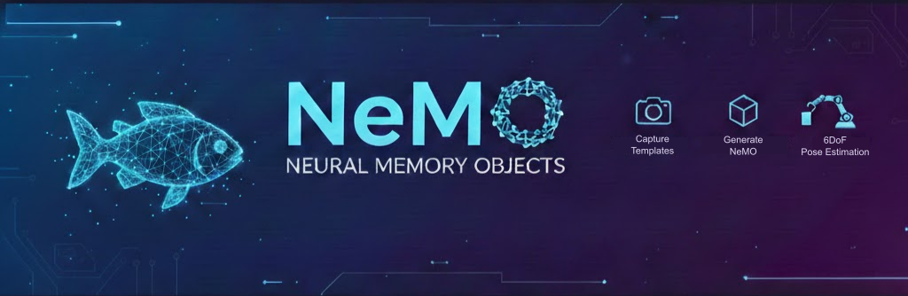

# NeMO: Neural Memory Objects


<p align="center">
  <a href="https://arxiv.org/abs/2602.04343v1"></a>
  <a href="https://sebastian-jung.github.io/nemo"></a>
  <a href="https://opensource.org/licenses/MIT"></a>
</p>
<p align="center">
  <a href="https://sebastian-jung.github.io/">Sebastian Jung</a>, Leonard Klüpfel, Rudolph Triebel, Maximilian Durner
</p>
<p align="center">
  German Aerospace Center (DLR)
</p>
<p align="center">
  
</p>


Official pytorch implementation of the paper **Finding NeMO: A Geometry-Aware Representation of Template Views for Few-Shot Perception**

This repository contains code for the `nemolib` package, an easy-to-use python package to generate Neural Memory Objects from images and use them to perform segmentation, detection and 6DoF Pose Estimation.

**Timeline**

* 2025/02/10: Code release

## Install

We recommend a package manager such as `conda` or `uv` and `python>=3.9`. If you have troubles installing `pytorch`, please follow [the official pytorch installation guide](https://pytorch.org/get-started/locally/).

```bash
# Clone repository
git clone git@github.com:DLR-RM/NeMO.git
cd NeMO

# Install dependencies
python -m pip install .

# Install pytorch >= 2.0.0
## CUDA 12.6 (Adapt to your setup)
pip install torch==2.8.0 torchvision==0.23.0 torchaudio==2.8.0 --index-url https://download.pytorch.org/whl/cu126
## CPU only
pip install torch==2.8.0 torchvision==0.23.0 torchaudio==2.8.0 --index-url https://download.pytorch.org/whl/cpu

# Afterwards you might have to call
plotly_get_chrome
```

Concatenate the checkpoint shards.

```bash
cat checkpoints/part_* > checkpoints/checkpoint.pth
```

## Run Inference

To run a full demo script, use

```bash
python examples/nemo_demo.py --object-name=object
```

We provide some example scripts to get you started with the `nemolib` package.

```bash
# Specify Object Name, chose from ['mug', 'coffee_machine']
OBJECT_NAME='mug'

# Generate Neural Memory Object using the encoder
python examples/run_encoder.py --image-glob="assets/${OBJECT_NAME}/*.jpg"

# Visualize the surface predictions of the template images interactivly
python examples/run_interactive_surface_reconstruction.py --nemo-path="out/${OBJECT_NAME}/NeMO.pt" --image-glob="assets/${OBJECT_NAME}/*.jpg"

# Have a look at the decoder outputs on a single image
python examples/run_decoder_on_image.py --nemo-path="out/${OBJECT_NAME}/NeMO.pt" --image-path="assets/${OBJECT_NAME}/object0_0.jpg"

# Run inference on a video
python examples/run_decoder_on_video.py --nemo-path="out/${OBJECT_NAME}/NeMO.pt" --video-path="assets/${OBJECT_NAME}/video.mp4"

# This script takes a video as input, cuts it in patches and performs detection on it
python examples/run_detection_on_video.py --nemo-path="out/${OBJECT_NAME}/NeMO.pt" --video-path="assets/${OBJECT_NAME}/video.mp4"
```

This codebase borrows code from [LEAP](https://hwjiang1510.github.io/LEAP/) and [Dust3r](https://europe.naverlabs.com/research/publications/dust3r-geometric-3d-vision-made-easy/), we would like to thank them for making their code public.

## 📖 Citation

```text
@inproceedings{jung2026,
  title={Finding NeMO: A Geometry-Aware Representation of Template Views for Few-Shot Perception},
  author={Sebastian Jung and Leonard Klüpfel and Rudolph Triebel and Maximilian Durner},
  journal={3DV},
  year={2026}
}
```
